<div align="center">
  
</div>

<div align="center">

`final-year cs` · `university of glasgow` · `she/her` · `bahrain ⇄ glasgow`

</div>

---

### ▸ ~/about

Final-year Computing Science student at the University of Glasgow. I like the parts of the stack where things talk to each other and occasionally fall over — sockets, threads, schedulers, and the odd rotor cipher — and I care just as much about the interface sitting on top of all of it. Equal parts systems nerd and UI perfectionist.

Passionate about **cybersecurity** and **software engineering**, happiest in a team, and quietly obsessed with making things that are both resilient and nice to look at.

> currently: turning caffeine into commits and learning to debug without crying — success rate improving.

---

### ▸ ~/stack

**languages**


**web & ui**


**systems & networking**


**data**


**tools**


---

### ▸ ~/selected-work

**value prospecting** — production-grade civic web platform, built with a six-person Agile team across four Scrum sprints. React + TypeScript frontend (global infographic view, personalised dashboard, multi-step impact-assessment flow) on a FastAPI + PostgreSQL backend, with full GitLab CI/CD.
`React` `TypeScript` `Tailwind` `FastAPI` `PostgreSQL`

**concurrent disk driver** — multithreaded disk device driver in C using POSIX threads, mutexes, and condition variables. Bridges application threads and a serialised device via bounded buffers and FCFS scheduling — with zero dynamic allocation.
`C` `pthreads` `concurrency`

**cryptographic attack programs** — known-plaintext and ciphertext-only attacks in Java that break an 8-rotor cipher machine using dictionary search and English frequency analysis, with the minimum ciphertext length for unambiguous decryption derived both theoretically and experimentally.
`Java` `cryptanalysis`

**ai-driven trading system** — real-time strategy engine that reads live financial-news sentiment to adjust trades on the fly. Built at Hack the Burgh XII.
`Python` `sentiment analysis` `APIs`

**client–server file transfer** — networked file-transfer app over Python sockets with uploads, downloads, directory listings, and structured handling for timeouts and protocol errors.
`Python` `sockets` `networking`

---

### ▸ ~/stats

<div align="center">


</div>

---

### ▸ ~/beyond-the-terminal

`Hack the Burgh XII` · `Code Olympics 2026` · `Model UN — Chair & Head of Chairs` · `World Scholar's Cup`

<details>
<summary><b>▸ cat kernel.log</b></summary>

<br>

```log
[ 02:47 ]  segfault. again. it's personal now.
[ 03:14 ]  refactored working code. for fun. for the aesthetic.
[ 03:58 ]  it compiled first try. deeply suspicious.
[ 04:20 ]  "i'll just fix one small bug before bed"
[ 06:11 ]  process exited 0. we will not speak of the journey.
```

</details>

---

### ▸ ~/connect

[](https://linkedin.com/in/bayanalkhuzaei)
[](https://github.com/xxbeeboxx)
[](mailto:bayannwaell@gmail.com)

<div align="center">
<br>
<i>built with curiosity, caffeine, and an unreasonable number of open tabs.</i>
</div>
